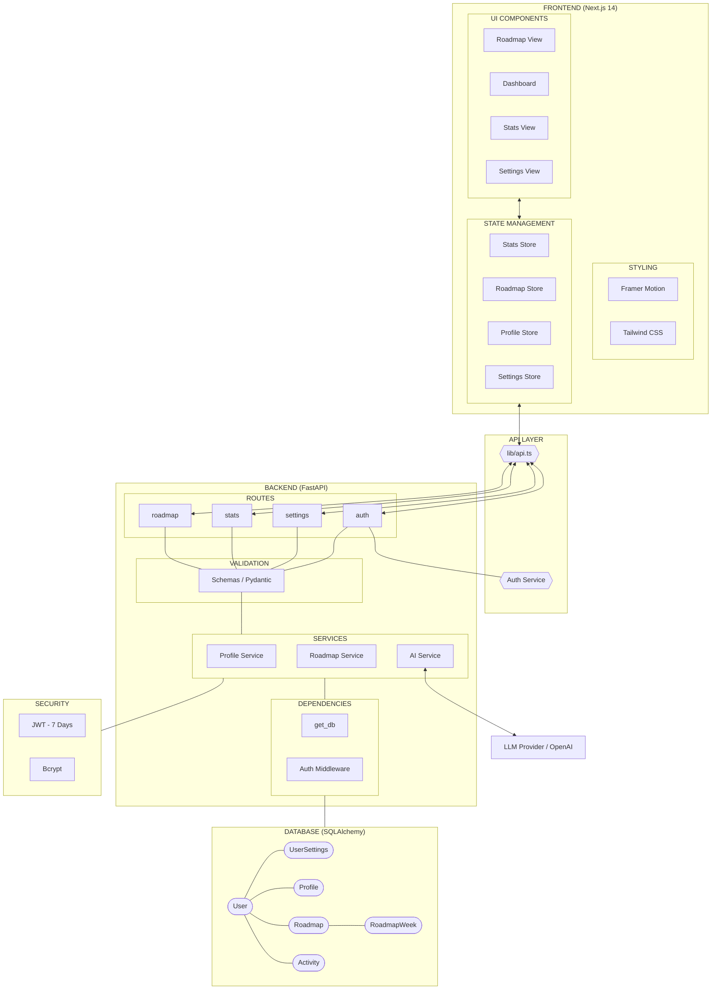
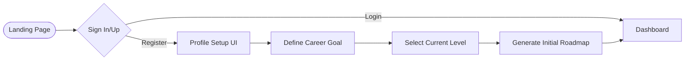
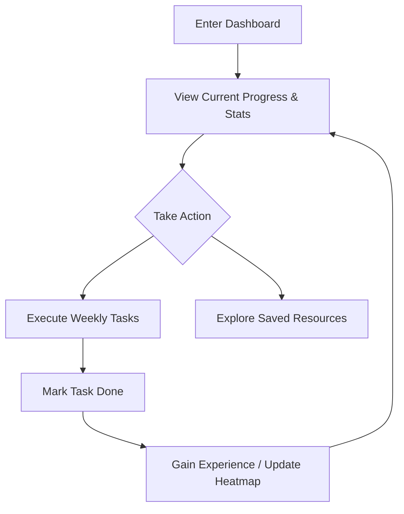
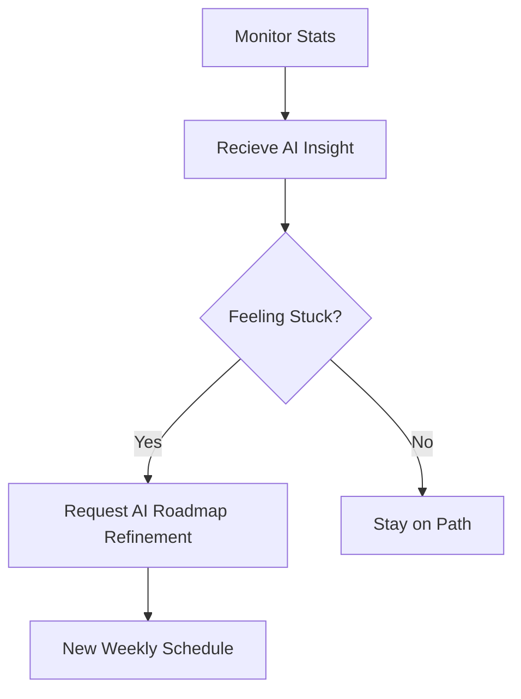

# SkillMap AI - Low-Level Design (LLD)

This document contains the core architectural blueprints for the SkillMap AI platform. It is designed to be easily accessible for developers and serves as the source of truth for the system's execution flow.

## ⚡ Unified System Flow

---

## 📘 Architectural Overview

### 1. Frontend
- **Framework**: Next.js (App Router)
- **State Management**: Zustand (Atomic & Persistent)
- **Visuals**: Framer Motion for premium animations.

### 2. Backend
- **Core**: FastAPI (Asynchronous Python)
- **Data Validation**: Pydantic Models
- **Auth**: Stateless JWT-based security.

### 3. Data layer
- **ORM**: SQLAlchemy
- **Database**: SQLite (Development) / PostgreSQL (Production)
- **Schema**: Centralized User entity with secondary Profile, Settings, and Roadmap extensions.

---

## 🛠 Project Execution Flow
1. **User Request**: Component -> Zustand Action.
2. **Network**: Zustand -> `apiRequest` (lib/api.ts) -> FastAPI Route.
3. **Logic**: Route -> Schema Validation -> Service Logic.
4. **Persistence**: Service -> SQLAlchemy -> Database Update.
5. **Feedback**: 200 OK -> UI State Update.

## 🛤 User Journey & Experience Flow

This section maps the paths a user takes through the SkillMap platform to achieve their career goals.

### 1. The "First Impression" Flow (Auth & Onboarding)

### 2. The Core Learning Loop (Daily Workflow)

### 3. Progressive Growth (Roadmap Refinement)

## 🛠 Feature-Specific Logic

| Flow | Logic |
| :--- | :--- |
| **Authentication** | Stateless JWT (stored in cookies/local storage) |
| **Roadmap Generation** | Intensive WEEKLY structure (1-3 month horizon) |
| **Gamification** | Real-time XP awarding based on task complexity |
| **Insights** | AI-driven analysis of heatmap and completion rates |

